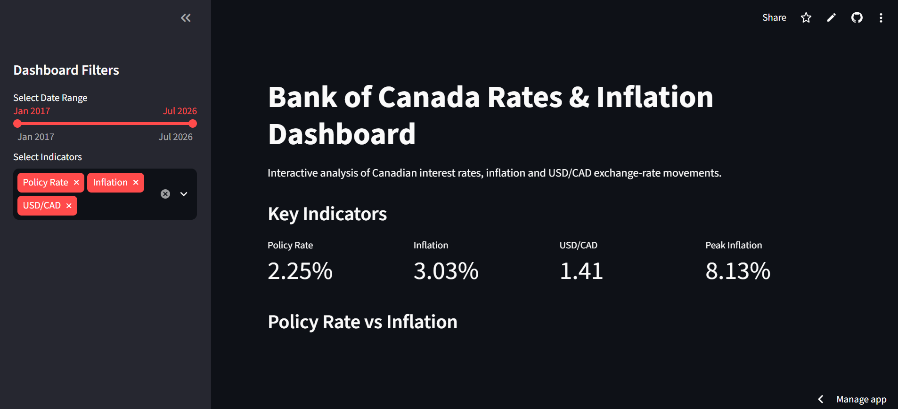

# Bank of Canada Rates & Inflation Dashboard

An interactive financial analytics dashboard for analyzing Canadian monetary policy, inflation, and USD/CAD exchange-rate movements using historical economic data.

The project combines data collection through REST APIs, data cleaning and transformation with Python/Pandas, statistical analysis, interactive Plotly visualizations, and a Streamlit dashboard.

---

##  Project Overview

The objective of this project is to analyze the relationship between:

- Bank of Canada policy interest rates
- Canadian Consumer Price Index (CPI)
- Inflation
- USD/CAD exchange rates

The project focuses on long-term economic trends and includes a detailed analysis of the **2022–2023 monetary policy tightening cycle**, when the Bank of Canada significantly increased interest rates in response to elevated inflation.

---

##  Objectives

- Collect economic data programmatically using REST APIs and public statistical datasets.
- Clean and validate raw economic datasets using Python and Pandas.
- Align datasets with different observation frequencies.
- Build a consolidated monthly analytical dataset.
- Classify monetary policy periods into Hiking, Holding, and Cutting cycles.
- Perform trend and correlation analysis.
- Analyze lagged relationships between policy rates and inflation.
- Study the 2022–2023 rate-hiking cycle.
- Build an interactive financial analytics dashboard using Streamlit and Plotly.

---

##  Technologies Used

| Technology | Purpose |
|---|---|
| Python | Data processing and analysis |
| Pandas | Data cleaning, transformation and analysis |
| Requests | REST API data collection |
| Plotly | Interactive visualizations |
| Streamlit | Interactive dashboard |
| REST APIs | Programmatic economic data collection |
| Git & GitHub | Version control and project hosting |

---

##  Project Structure

```text

Bank Of Canada Dashboard/
│
├── app.py
├── api_test.py
├── cpi_process.py
├── merge_data.py
├── requirements.txt
├── README.md
│
├── data/
│   └── processed/
│       ├── analysis_dataset.csv
│       └── master_dataset.csv
│
└── Data/
    └── cpi_raw/


Public Economic Data
        │
        ▼
REST API / Statistical Dataset
        │
        ▼
Raw Data Collection
        │
        ▼
Data Cleaning & Validation
        │
        ▼
Date Transformation
        │
        ▼
Monthly Data Alignment
        │
        ▼
Master Dataset
        │
        ▼
Statistical Analysis
        │
        ▼
Plotly Visualizations
        │
        ▼
Streamlit Dashboard
```

How to Run the Project

1. Clone the repository
git clone https://github.com/Ishankhan07/Bank-of-Canada-Rates-Inflation-Dashboard-.git

2. Navigate to the project
cd Bank-of-Canada-Rates-Inflation-Dashboard-

3. Create a virtual environment
python -m venv venv

4. Activate the environment
Windows
venv\Scripts\activate

5. Install dependencies
pip install -r requirements.txt

6. Run the Streamlit dashboard
streamlit run app.py

The dashboard will open in your browser.

---

Main Python Scripts
api_test.py

Used to test connectivity with the REST API and validate API responses.

cpi_process.py

Processes the Statistics Canada CPI dataset and generates the cleaned monthly CPI dataset.

merge_data.py

Aligns and merges the economic datasets into a common monthly analytical dataset.

app.py

Contains the final Streamlit dashboard and interactive Plotly visualizations.


## 📊 Dashboard Screenshots

### Main Dashboard


### Policy Rate vs Inflation


### Correlation Analysis


### Interest Rate Cycle


### USD/CAD Exchange Rate

